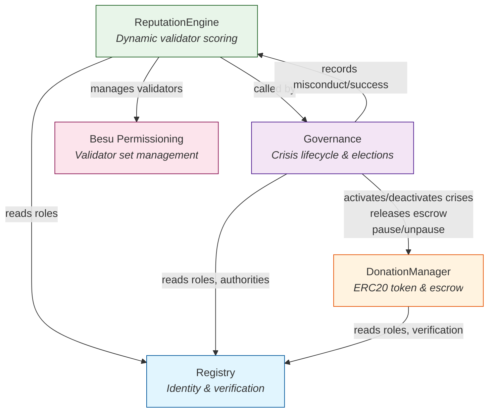
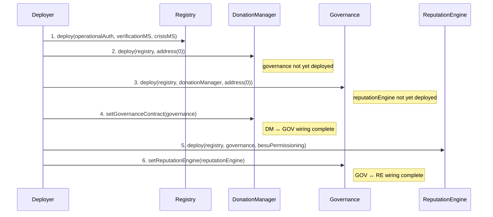
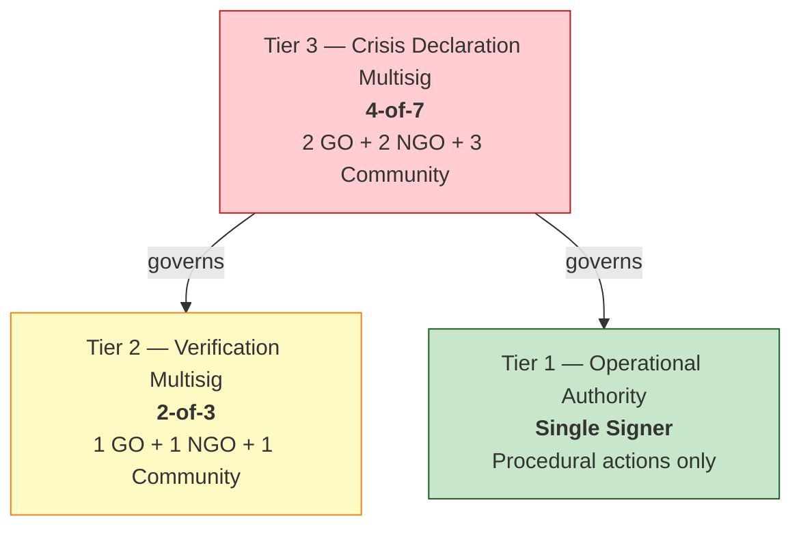

# System Architecture — OpenAID +212

## Overview

The system runs on **Hyperledger Besu** with **QBFT consensus** (4-node network, 2-second block time) and implements four smart contracts that together provide:

- **Identity and verification** — who is allowed to participate, and in what capacity
- **Financial escrow and distribution** — how donated funds and goods flow from donors to beneficiaries
- **Democratic governance** — how coordinators are elected and held accountable
- **Dynamic reputation scoring** — how honest behavior is rewarded and misconduct is punished, with consequences for validator participation

All business logic lives on-chain. The frontend is a presentation layer only.

## Four-Contract Architecture

The system is composed of four contracts deployed in strict order, each building on the previous:

| Order | Contract | Purpose | Dependencies |
|-------|----------|---------|-------------|
| 1 | **Registry** | Identity layer : roles, verification, authority management | None |
| 2 | **DonationManager** | Financial engine : ERC20 token, escrow, distribution | Registry |
| 3 | **Governance** | Democratic engine : crisis lifecycle, elections, misconduct, re-election | Registry, DonationManager |
| 4 | **ReputationEngine** | Scoring engine : validator reputation, Besu permissioning | Registry, Governance |

### Contract Dependency Graph

### Deployment and Wiring Sequence

The circular dependency between Governance and ReputationEngine (Governance calls RE for scoring; RE requires Governance as its caller) is broken by deploying with `address(0)` placeholders and wiring up post-deployment.

## Crisis Lifecycle Overview

Every crisis follows a phase progression with multiple possible paths, including a re-election cycle after misconduct:

 
 
### Escrow-Phase Link

| Crisis Phase | Escrow State | Donations | Distributions |
|---|---|---|---|
| DECLARED | Open | Yes | No (no coordinator) |
| VOTING | Open | Yes | No (no coordinator) |
| ACTIVE | Sealed | No | Yes (coordinator distributes from escrow) |
| REVIEW | Frozen | No | No (under investigation) |
| PAUSED | Frozen | No | No (awaiting re-election) |
| VOTING (re-election) | Open | Yes | No |
| ACTIVE (new coordinator) | Sealed | No | Yes |
| CLOSED | Closed | No | No |

## Escrow Authority Model

a desing choice was made that makes the coordinator **never holds funds**. When a coordinator is elected, `releaseEscrowToCoordinator()` records the coordinator's address as having distribution authority (right to use the funds), but the AID tokens remain in the DonationManager contract (`address(this)`). Distribution calls (`distributeFTToBeneficiary()`) transfer tokens directly from the contract's escrow to the beneficiary, deducting from `crisisEscrow[crisisId]`.

This prevents a misbehaving coordinator from taking funds. If misconduct is confirmed, the coordinator is banned and loses distribution authority (can't be coordinator for that crisis again),  and the funds are still in escrow and available for the next coordinator.

## Three-Tier Authority Model

Authority is split across three tiers to prevent a single-point-of-trust contradiction in a zero-trust system. Each tier corresponds to a different risk level and requires a different approval threshold.

| Tier | Signers | Threshold | Actions | Rationale |
|------|---------|-----------|---------|-----------|
| **Tier 1** | Single signer | 1-of-1 | `startVoting()`, `closeCrisis()`, `setSystemPhase()`, `recordParticipation()` | Low-risk procedural triggers that don't grant or remove power |
| **Tier 2** | 2-of-3 multisig (1 GO + 1 NGO + 1 Community) | 2-of-3 | `verifyNGO()`, `verifyBeneficiary()` | Power-granting actions — verification unlocks voting and validator rights |
| **Tier 3** | 4-of-7 multisig (2 GO + 2 NGO + 3 Community) | 4-of-7 | `declareCrisis()`, `initiateMisconductVote()`, `updateAuthority()`, `setPhaseConfig()` | System-critical actions — no single actor class can reach threshold alone |

The Registry stores multisig **contract addresses** (e.g., Gnosis Safe). Signer management and threshold enforcement happen inside those multisig contracts, not in the Registry. This separation keeps the on-chain Registry simple while delegating the complex multi-party approval logic to battle-tested multisig implementations.

Tier 3 can update any authority address (including itself) via `updateOperationalAuthority()`, `updateVerificationMultisig()`, and `updateCrisisDeclarationMultisig()`. Each update atomically revokes the old address's role and grants it to the new one.

## On-Chain vs Off-Chain Boundary

| Aspect | On-Chain | Off-Chain |
|--------|----------|-----------|
| **Identity** | Role assignment, verification status, authority addresses | WANGO proof validation, KYC checks, physical identity verification |
| **Donations** | ERC20 minting, escrow hold/release, in-kind record tracking | Physical item logistics, IPFS metadata upload, MAD→AID conversion |
| **Governance** | Crisis declaration, candidate registration, voting, election finalization | Multisig signer coordination (Gnosis Safe), off-chain deliberation |
| **Misconduct** | Misconduct vote initiation/finalization, reputation slashing, escrow freeze | Evidence gathering, investigation, Tier-3 deliberation |
| **Reputation** | Score calculation, validator activation/deactivation | Epoch trigger (cron script calls `updateScores()`), participation monitoring |
| **Consensus** | Besu QBFT block production, validator set via permissioning contract | Node infrastructure, Docker networking, Prometheus/Grafana monitoring |

The social layer (multisig signers, cron jobs, IPFS, monitoring) handles everything that requires human judgment or external infrastructure. The smart contracts enforce the rules that the social layer has agreed upon.

## Key Design Decisions

| Decision | Choice | Rationale |
|----------|--------|-----------|
| **ERC20 inside DonationManager** | AID token (`OpenAID Donation Token`) is inherited via `ERC20`, not a separate contract | Avoids a separate deployment + approval flow; escrow is just holding tokens in `address(this)` |
| **In-kind tracking: custom struct, NOT ERC721** | `InKindDonation` struct with `Status` enum and manual `_nftOwners` mapping | Inheriting both ERC20 and ERC721 from OpenZeppelin v5 causes a `_transfer(address,address,uint256)` signature collision. Custom tracking avoids this while providing the same lifecycle guarantees |
| **Escrow authority model** | Coordinator gets distribution authority, not fund custody | Prevents misbehaving coordinators from absconding with funds; tokens remain in contract escrow |
| **PAUSED state with re-election** | Misconduct confirmation → PAUSED (not CLOSED); banned coordinator, re-election cycle | Remaining escrow is preserved for a new coordinator; crisis doesn't die from one bad actor |
| **Tiered multisig authority** | Three tiers with different thresholds (1-of-1, 2-of-3, 4-of-7) | No single actor class can unilaterally take system-critical actions; low-risk actions remain fast |
| **GO Vote Compression** | If all GOs vote unanimously → compress to 1 vote; if split → normal counting | Prevents government bloc from capturing coordinator elections while preserving their voice when split |
| **Integer math scaled by 100** | All percentages/weights use `uint256` with `SCALE = 100` | Solidity has no floating point; scaling by 100 gives two decimal places of precision with simple integer division |
| **Quadratic penalties, linear rewards** | Penalty grows as `n²`; reward is constant (dampened by ceiling reducer) | Asymmetric by design: one misconduct is recoverable, but repeated offenses quickly become devastating |
| **MIN_VALIDATORS = 4** | Safety floor: never deactivate validators below 4 active | QBFT consensus requires a minimum validator set; collapsing below 4 would halt the chain |
| **0 decimals on AID token** | `decimals() returns 0` | 1 AID = 1 MAD (Moroccan Dirham); whole units only, consistent with integer-only math |
| **Permissionless `updateScores()`** | Anyone can call it (gated only by epoch guard) | Removes trust dependency on any single entity for epoch progression; cron script is a convenience, not a requirement |
| **Per-crisis beneficiary verification** | `crisisVerification[beneficiary][crisisId]` | Prevents permanent voting blocs — a beneficiary verified for crisis A cannot vote in crisis B |
| **Direct in-kind donations** | Three-party flow (Donor → Facility → Beneficiary) for non-crisis in-kind donations | Mirrors directDonateFT for tokens; facility (verified GO/NGO) handles logistics |
