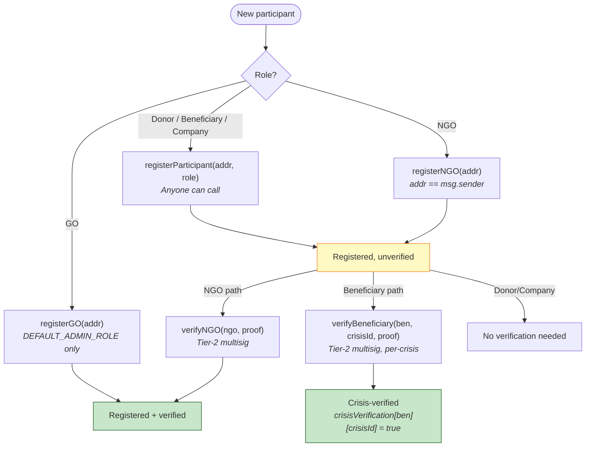
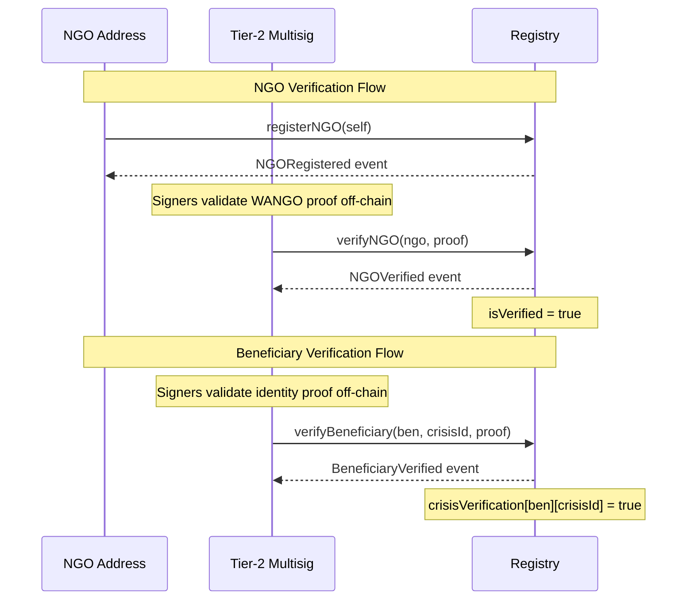

# Registry — Identity and Verification Layer

The Registry (`contracts/Registry.sol`) is the base layer of OpenAID +212. It is the single source of truth for:

- **Who** an address represents (role assignment)
- **Whether** they are verified (identity confirmation)
- **Who** holds authority to perform privileged actions (three-tier authority addresses)

Every other contract in the system reads from the Registry to make authorization decisions. The Registry has no dependencies on other OpenAID contracts — it is always deployed first.

## Contract Inheritance

```
Registry is AccessControl, IRegistry
```

- **AccessControl** (OpenZeppelin v5): Role-based permission management via `bytes32` role identifiers
- **IRegistry**: Interface defining the public API, events, and the `Participant` struct + `Role` enum

## Role Enum

Defined in `IRegistry`:

```solidity
enum Role { GO, NGO, Donor, Beneficiary, PrivateCompany }
// Values: GO=0, NGO=1, Donor=2, Beneficiary=3, PrivateCompany=4
```

| Role | Description | Registration Path | Verification Required |
|------|-------------|-------------------|-----------------------|
| **GO** (0) | Government Organisation | `registerGO()` — admin only | Pre-verified at registration |
| **NGO** (1) | Non-Governmental Organisation | `registerNGO()` — self-registration | Yes — Tier-2 via `verifyNGO()` |
| **Donor** (2) | Individual or institutional donor | `registerParticipant()` — open | No |
| **Beneficiary** (3) | Aid recipient | `registerParticipant()` — open | Per-crisis via `verifyBeneficiary()` |
| **PrivateCompany** (4) | Corporate participant | `registerParticipant()` — open | No |

## Participant Record

```solidity
struct Participant {
    address addr;           // The participant's address
    Role    role;           // One of the 5 roles
    bool    exists;         // True if registered (existence sentinel)
    bool    isVerified;     // True if identity is confirmed
    uint256 registeredAt;   // Block timestamp of registration
}
```

Stored in `mapping(address => Participant) private _registry`.

## Registration Paths

### Open Registration: `registerParticipant(address addr, Role role)`

- Available for: **Donor**, **Beneficiary**, **PrivateCompany**
- Caller: Anyone (including operators performing assisted registration for beneficiaries)
- `addr` need not equal `msg.sender` — this allows field operators to register beneficiaries on their behalf
- Reverts with `InvalidRoleForOpenRegistration` if role is GO or NGO
- Reverts with `AlreadyRegistered` if address is already in the registry
- Sets `isVerified = false`

### NGO Self-Registration: `registerNGO(address addr)`

- Available for: **NGO** only
- Caller: Must be `msg.sender == addr` (enforced by `SelfRegistrationRequired` error)
- This constraint prevents third parties from claiming an address as an NGO without consent, which would block that address from self-registering with a different role
- Sets `isVerified = false` — verification requires a separate Tier-2 action

### Admin-Only Registration: `registerGO(address addr)`

- Available for: **GO** only
- Caller: Must hold `DEFAULT_ADMIN_ROLE` (the deployer)
- GOs are **pre-verified**: `isVerified = true` at registration
- This reflects the real-world trust model: government organisations are known entities whose identity is established before the system is deployed
- Adding GOs post-deployment requires a governance proposal to grant `DEFAULT_ADMIN_ROLE`, preventing validator-set capture via proxy GO registration

### Registration Flow Diagram



## Verification Flows

### NGO Verification: `verifyNGO(address ngo, bytes calldata proof)`

- **Caller**: Tier-2 Verification Multisig (`VERIFICATION_ROLE`)
- **Preconditions**: Address must be registered, must be Role.NGO, must not already be verified
- **Effect**: Sets `isVerified = true` on the Participant record
- **Proof parameter**: Contains off-chain WANGO verification evidence (e.g., registration certificate hash). The proof is kept in calldata for permanent on-chain auditability but is **not stored** in contract state. The Tier-2 multisig signers are responsible for validating the proof before signing the transaction.
- **Events**: `NGOVerified(ngo)`

### Beneficiary Verification: `verifyBeneficiary(address beneficiary, uint256 crisisId, bytes calldata proof)`

- **Caller**: Tier-2 Verification Multisig (`VERIFICATION_ROLE`)
- **Preconditions**: Address must be registered, must be Role.Beneficiary
- **Effect**: Sets `crisisVerification[beneficiary][crisisId] = true`
- **Scope**:  Per-crisis — verification for crisis 1 does not carry over to crisis 2. Each crisis requires fresh verification. This prevents a coordinator from building a loyal group of pre-verified beneficiaries in one crisis and leveraging their votes in future elections.
- **Events**: `BeneficiaryVerified(beneficiary, crisisId)`
### Important clarification : What Is "Proof"?
For NGOs, The proof is evidence that the NGO is a legitimate humanitarian organization, Via WANGO certificate, Legal incorporation documents ...., these evidance need to be verified off-chain. and  The proof bytes parameter would contain an IPFS hash (CID) pointing to a bundle of these documents
- The Tier-2 multisig signers (1 GO + 1 NGO + 1 Community rep) independently download the documents from IPFS, verify them off-chain (check the ministry database, confirm the WANGO listing, review the activity report), and if 2-of-3 agree it's legitimate, they sign the transaction.

For Beneficiaries, the proof is evidence that this person is genuinely affected by this specific crisis. This would require more in feild verification (off-chain) or documents in some case (Proof of residence..), same concept as previous the `proof `is an IPFS hash pointing to these documents. The Tier-2 multisig reviews them off-chain.



## Authority Management

All authority updates are gated by `CRISIS_DECLARATION_ROLE` (Tier 3). Each function atomically revokes the old address's role and grants it to the new address.

| Function | Updates | AccessControl Role |
|----------|---------|-------------------|
| `updateOperationalAuthority(newAuthority)` | `operationalAuthority` | `OPERATIONAL_ROLE` |
| `updateVerificationMultisig(newMultisig)` | `verificationMultisig` | `VERIFICATION_ROLE` |
| `updateCrisisDeclarationMultisig(newMultisig)` | `crisisDeclarationMultisig` | `CRISIS_DECLARATION_ROLE` |

The most sensitive operation is `updateCrisisDeclarationMultisig`: the current Tier-3 multisig authorizes its own replacement. After the call, the old address holds no `CRISIS_DECLARATION_ROLE` and cannot reverse the change.


## Access Control Matrix

| Function | DEFAULT_ADMIN | OPERATIONAL (T1) | VERIFICATION (T2) | CRISIS_DECL (T3) | Anyone |
|----------|:---:|:---:|:---:|:---:|:---:|
| `registerGO()` | x | | | | |
| `registerNGO()` | | | | | x (self only) |
| `registerParticipant()` | | | | | x |
| `verifyNGO()` | | | x | | |
| `verifyBeneficiary()` | | | x | | |
| `updateOperationalAuthority()` | | | | x | |
| `updateVerificationMultisig()` | | | | x | |
| `updateCrisisDeclarationMultisig()` | | | | x | |
| `getParticipant()` | | | | | x |
| `isVerifiedValidator()` | | | | | x |
| `isCrisisVerifiedBeneficiary()` | | | | | x |

## AccessControl Role Constants

```solidity
bytes32 public constant OPERATIONAL_ROLE          = keccak256("OPERATIONAL_ROLE");
bytes32 public constant VERIFICATION_ROLE         = keccak256("VERIFICATION_ROLE");
bytes32 public constant CRISIS_DECLARATION_ROLE   = keccak256("CRISIS_DECLARATION_ROLE");
```

`DEFAULT_ADMIN_ROLE` is the OpenZeppelin zero-value role (`0x00`), granted to the deployer in the constructor. After all GOs are registered, the deployer should renounce this role to eliminate the backdoor.

