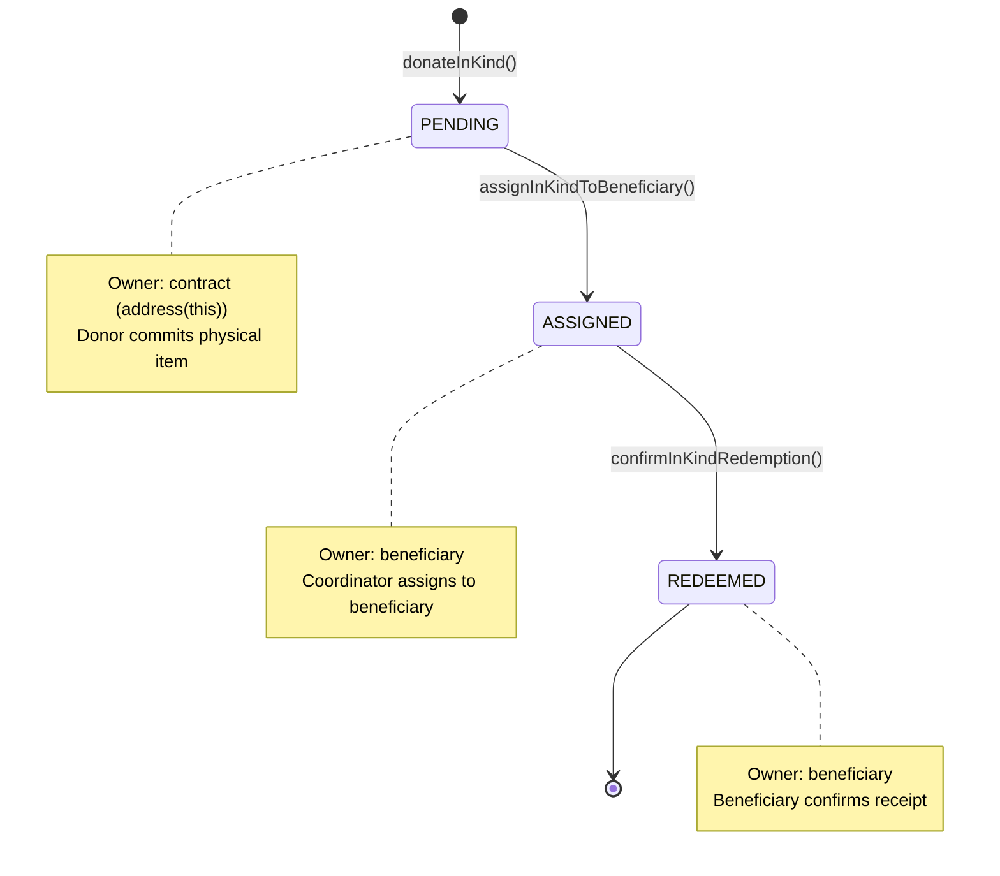
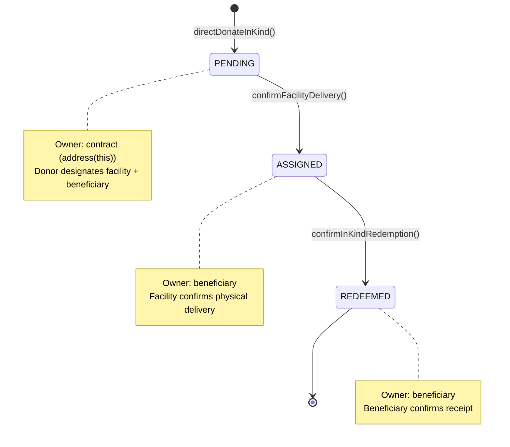

# DonationManager — Financial Engine

## Purpose

The DonationManager (`contracts/DonationManager.sol`) handles all asset flows in OpenAID +212. It is responsible for:

- Minting and managing the **AID ERC20 token** (1 AID = 1 MAD)
- Holding **crisis-bound escrow** and granting **distribution authority** to coordinators
- Tracking **in-kind donations** through a custom NFT-like lifecycle
- Enabling **direct non-crisis donations** (FT and in-kind) from donors to beneficiaries
- Enforcing the **three-way verification flow** (donor → coordinator → beneficiary)
- Supporting **escrow freeze/unfreeze** during misconduct investigations

## Contract Inheritance

```
DonationManager is ERC20, AccessControl, IDonationManager
```

- **ERC20** (OpenZeppelin v5): The AID fungible token — `"OpenAID Donation Token"` with symbol `"AID"`
- **AccessControl** (OpenZeppelin v5): Admin role for governance contract wiring
- **IDonationManager**: Interface defining the public API and events

## ERC20 AID Token

| Property | Value |
|----------|-------|
| Name | `OpenAID Donation Token` |
| Symbol | `AID` |
| Decimals | `0` (overridden from ERC20's default of 18) |
| Minting | On-chain via `_mint()` — no ETH payment required (thesis prototype) |
| Peg | 1 AID = 1 MAD (Moroccan Dirham), whole units only |

The `decimals()` function returns `0`, consistent with the system's integer-only math convention. In production, minting would be gated behind ETH/stablecoin payment.

## Donation Paths

### 1. Crisis-Bound FT Donations: `donateFT(uint256 crisisId, uint256 amount)`

- **Caller**: Any registered participant
- **Flow**: Mints `amount` AID tokens to `address(this)` (escrow)
- **State updates**:
  - `crisisEscrow[crisisId] += amount`
  - `donorContribution[msg.sender][crisisId] += amount`
- **Preconditions**: Crisis must be active, amount > 0, caller registered
- **Voting power**: `donorContribution` is read by Governance to enforce per-role donation caps for voting eligibility

### 2. Direct FT Donations: `directDonateFT(address beneficiary, uint256 amount)`

- **Caller**: Any registered participant
- **Flow**: Mints `amount` AID tokens **directly to the beneficiary**
- **No crisis required** — this is for non-crisis peer-to-peer aid
- **No voting power** — `donorContribution` is NOT updated
- **Preconditions**: Beneficiary must be a registered Beneficiary (checked via Registry)
- **Events**: `DirectFTDonation(donor, beneficiary, amount)`

### 3. Crisis-Bound In-Kind Donations: `donateInKind(uint256 crisisId, string calldata metadataURI)`

- **Caller**: Any registered participant
- **Flow**: Creates an `InKindDonation` record with auto-incremented ID (starting at 1)
- **Metadata**: `metadataURI` should point to an IPFS document describing the physical item (type, condition, quantity, photos)
- **Ownership**: Contract holds the item (`_nftOwners[nftId] = address(this)`)
- **Status**: Starts as `PENDING`, `facility` set to `address(0)` (crisis-bound)
- **Returns**: The assigned `nftId`

### 4. Direct In-Kind Donations: `directDonateInKind(address facility, address beneficiary, string calldata metadataURI)`

- **Caller**: Any registered participant
- **Flow**: Creates an `InKindDonation` record routed through a verified facility (GO/NGO)
- **Three-party flow**: Donor → Facility confirms delivery → Beneficiary confirms receipt
- **No crisis required** — `crisisId` is set to 0
- **Preconditions**: Facility must be a verified validator, beneficiary must be a registered Beneficiary
- **Events**: `DirectInKindDonation(donor, facility, beneficiary, nftId)`

#### Why Not ERC721?

Inheriting both ERC20 and ERC721 from OpenZeppelin v5 causes a function signature collision: both define `_transfer(address, address, uint256)` with incompatible semantics. Rather than introducing complex resolution patterns, in-kind donations use a custom struct with manual ownership tracking. This provides the same lifecycle guarantees (PENDING → ASSIGNED → REDEEMED) without the inheritance conflict.

## In-Kind Donation Lifecycle

```solidity
enum Status { PENDING, ASSIGNED, REDEEMED }

struct InKindDonation {
    uint256 nftId;        // Auto-incremented item ID (starts at 1)
    address donor;        // Address that committed the item
    string  metadataURI;  // IPFS URI: item description, photos, condition
    uint256 crisisId;     // Crisis this item is committed to (0 = direct donation)
    Status  status;       // Current lifecycle stage
    address assignedTo;   // Beneficiary assigned by coordinator
    address facility;     // GO/NGO handling logistics (address(0) for crisis-bound)
}
```

### Crisis-Bound Path



### Direct In-Kind Path (Three-Party Flow)



| Step | Crisis-Bound Path | Direct Path |
|------|------------------|-------------|
| 1 | Donor: `donateInKind()` | Donor: `directDonateInKind(facility, beneficiary, uri)` |
| 2 | Coordinator: `assignInKindToBeneficiary()` | Facility: `confirmFacilityDelivery()` |
| 3 | Beneficiary: `confirmInKindRedemption()` | Beneficiary: `confirmInKindRedemption()` |

## Escrow Authority Model

The coordinator **never holds funds**. This is a key security property:

### `releaseEscrowToCoordinator(uint256 crisisId, address coordinator)`

- **Caller**: Governance contract only
- **Flow**: Records coordinator address, **does NOT transfer tokens**
- **Side effects**:
  - Sets `crisisCoordinator[crisisId] = coordinator` (enables distribution calls)
  - Escrow balance is **NOT zeroed** — funds remain in `address(this)`
- **Preconditions**: Coordinator not zero, escrow not empty

### `distributeFTToBeneficiary(uint256 crisisId, address beneficiary, uint256 amount)`

- **Caller**: Elected coordinator only (`msg.sender == crisisCoordinator[crisisId]`)
- **Flow**: Transfers AID from **contract escrow** (`address(this)`) to the beneficiary
- **State updates**: `crisisEscrow[crisisId] -= amount`
- **Preconditions**: Crisis not paused, beneficiary is crisis-verified, amount > 0, sufficient escrow balance

### FT Donation Flow

```mermaid
flowchart LR
    DONOR["Donor<br/>donateFT()"] -->|mint AID| ESCROW["Crisis Escrow<br/>address(this)"]
    ESCROW -->|distributeFTToBeneficiary()| BEN["Beneficiary<br/>crisis-verified"]
    COORD["Coordinator<br/>(authority only)"] -.->|authorizes| ESCROW

    style ESCROW fill:#fff3e0,stroke:#e65100
    style COORD fill:#f3e5f5,stroke:#4a148c
    style BEN fill:#c8e6c9,stroke:#1b5e20
```

## Crisis Pause/Unpause

When a misconduct investigation begins or misconduct is confirmed, the escrow is frozen:

### `pauseCrisis(uint256 crisisId)`

- **Caller**: Governance contract only
- **Effects**:
  - `crisisPaused[crisisId] = true`
  - `activeCrises[crisisId] = false` (stops new donations)
  - `crisisCoordinator[crisisId] = address(0)` (revokes distribution authority)
- **Events**: `CrisisPaused(crisisId)`

### `unpauseCrisis(uint256 crisisId)`

- **Caller**: Governance contract only
- **Effects**:
  - `crisisPaused[crisisId] = false`
  - `activeCrises[crisisId] = true` (reopens donations)
- **Events**: `CrisisUnpaused(crisisId)`

### Pause Checks

Both `distributeFTToBeneficiary()` and `assignInKindToBeneficiary()` check `crisisPaused[crisisId]` and revert with `CrisisIsPaused` if true. This ensures no distributions occur during an investigation or while the crisis is paused for re-election.

## Crisis Lifecycle Integration

The DonationManager tracks crisis activation state via the `activeCrises` mapping. Governance controls this:

| Function | Called By | Effect |
|----------|----------|--------|
| `activateCrisis(crisisId)` | Governance (on `declareCrisis()`) | Opens donations for this crisis |
| `deactivateCrisis(crisisId)` | Governance (on `finalizeElection()`) | Closes donations — coordinator now distributes |
| `pauseCrisis(crisisId)` | Governance (on `initiateMisconductVote()` or `finalizeMisconductVote()` confirmed) | Freezes escrow, stops donations, revokes coordinator |
| `unpauseCrisis(crisisId)` | Governance (on `finalizeMisconductVote()` dismissed or `startVoting()` from PAUSED) | Unfreezes escrow, reopens donations |

## State Variables

| Variable | Type | Purpose |
|----------|------|---------|
| `registry` | `IRegistry` (immutable) | Source of truth for identity |
| `governanceContract` | `address` | Governance contract — set post-deployment |
| `activeCrises` | `mapping(uint256 => bool)` | Whether a crisis is accepting donations |
| `crisisEscrow` | `mapping(uint256 => uint256)` | AID held in escrow per crisis |
| `donorContribution` | `mapping(address => mapping(uint256 => uint256))` | Per-donor per-crisis donation total |
| `crisisCoordinator` | `mapping(uint256 => address)` | Elected coordinator per crisis |
| `crisisPaused` | `mapping(uint256 => bool)` | Whether a crisis is frozen |
| `inKindDonations` | `mapping(uint256 => InKindDonation)` | In-kind donation records |
| `_nftOwners` | `mapping(uint256 => address)` | Current holder of each in-kind item |
| `_nftCounter` | `uint256` | Auto-incrementing item ID counter |

## View Functions

| Function | Returns |
|----------|---------|
| `getDonorContribution(donor, crisisId)` | Cumulative AID donated by `donor` to `crisisId` |
| `getCrisisEscrowBalance(crisisId)` | AID currently held in escrow for `crisisId` |
| `getInKindDonation(nftId)` | Full `InKindDonation` struct |
| `nftOwnerOf(nftId)` | Current holder address (`address(this)` if PENDING, beneficiary if ASSIGNED/REDEEMED) |
| `nftTotalSupply()` | Total number of in-kind donations minted |

## Custom Errors

| Error | Trigger |
|-------|---------|
| `NotRegistered(caller)` | Caller not in Registry |
| `CrisisNotActive(crisisId)` | Donation to inactive crisis |
| `CrisisAlreadyActive(crisisId)` | Double activation |
| `CrisisNotCurrentlyActive(crisisId)` | Deactivation of inactive crisis |
| `ZeroAmount()` | Zero-value donation or distribution |
| `NotGovernance(caller)` | Non-Governance caller for restricted functions |
| `NotCoordinator(caller, crisisId)` | Non-coordinator calling distribution functions |
| `NotAssignedBeneficiary(caller, nftId)` | Wrong beneficiary confirming redemption |
| `WrongNFTStatus(nftId, expected, actual)` | In-kind item not in expected lifecycle stage |
| `NotCrisisVerifiedBeneficiary(beneficiary, crisisId)` | Beneficiary not verified for this crisis |
| `ZeroAddress()` | Zero address in constructor or setGovernanceContract |
| `EmptyEscrow(crisisId)` | Releasing escrow with zero balance |
| `InsufficientEscrow(crisisId, requested)` | Distribution amount exceeds remaining escrow |
| `NFTNotFound(nftId)` | Nonexistent in-kind item ID |
| `NotRegisteredBeneficiary(beneficiary)` | Direct donation to non-beneficiary |
| `NotVerifiedValidator(facility)` | Facility is not a verified GO/NGO |
| `NotFacility(caller, nftId)` | Caller is not the designated facility |
| `CrisisIsPaused(crisisId)` | Distribution during frozen crisis |
