# DonationManager — Financial Engine

## Purpose

The DonationManager (`contracts/DonationManager.sol`) handles all asset flows in OpenAID +212. It is responsible for:

- Minting and managing the **AID ERC20 token** (1 AID = 1 MAD)
- Holding **crisis-bound escrow** and granting **distribution authority** to coordinators
- Tracking **in-kind donations** through a custom NFT-like lifecycle
- Enabling **direct non-crisis donations** (FT and in-kind) from donors to beneficiaries
- Enforcing the **three-way verification flow** (donor → coordinator → beneficiary)
- Supporting **escrow freeze/unfreeze** during misconduct investigations

## Contract Inheritance

```
DonationManager is ERC20, AccessControl, IDonationManager
```

- **ERC20** (OpenZeppelin v5): The AID fungible token — `"OpenAID Donation Token"` with symbol `"AID"`
- **AccessControl** (OpenZeppelin v5): Admin role for governance contract wiring
- **IDonationManager**: Interface defining the public API and events

## ERC20 AID Token

| Property | Value |
|----------|-------|
| Name | `OpenAID Donation Token` |
| Symbol | `AID` |
| Decimals | `0` (overridden from ERC20's default of 18) |
| Minting | On-chain via `_mint()` — no ETH payment required (thesis prototype) |
| Peg | 1 AID = 1 MAD (Moroccan Dirham), whole units only |

The `decimals()` function returns `0`, consistent with the system's integer-only math convention. In production, minting would be gated behind ETH/stablecoin payment.

## Donation Paths

### 1. Crisis-Bound FT Donations: `donateFT(uint256 crisisId, uint256 amount)`

- **Caller**: Any registered participant
- **Flow**: Mints `amount` AID tokens to `address(this)` (escrow)
- **State updates**:
  - `crisisEscrow[crisisId] += amount`
  - `donorContribution[msg.sender][crisisId] += amount`
- **Preconditions**: Crisis must be active, amount > 0, caller registered
- **Voting power**: `donorContribution` is read by Governance to enforce per-role donation caps for voting eligibility

### 2. Direct FT Donations: `directDonateFT(address beneficiary, uint256 amount)`

- **Caller**: Any registered participant
- **Flow**: Mints `amount` AID tokens **directly to the beneficiary**
- **No crisis required** — this is for non-crisis peer-to-peer aid
- **No voting power** — `donorContribution` is NOT updated
- **Preconditions**: Beneficiary must be a registered Beneficiary (checked via Registry)
- **Events**: `DirectFTDonation(donor, beneficiary, amount)`

### 3. Crisis-Bound In-Kind Donations: `donateInKind(uint256 crisisId, string calldata metadataURI)`

- **Caller**: Any registered participant
- **Flow**: Creates an `InKindDonation` record with auto-incremented ID (starting at 1)
- **Metadata**: `metadataURI` should point to an IPFS document describing the physical item (type, condition, quantity, photos)
- **Ownership**: Contract holds the item (`_nftOwners[nftId] = address(this)`)
- **Status**: Starts as `PENDING`, `facility` set to `address(0)` (crisis-bound)
- **Returns**: The assigned `nftId`

### 4. Direct In-Kind Donations: `directDonateInKind(address facility, address beneficiary, string calldata metadataURI)`

- **Caller**: Any registered participant
- **Flow**: Creates an `InKindDonation` record routed through a verified facility (GO/NGO)
- **Three-party flow**: Donor → Facility confirms delivery → Beneficiary confirms receipt
- **No crisis required** — `crisisId` is set to 0
- **Preconditions**: Facility must be a verified validator, beneficiary must be a registered Beneficiary
- **Events**: `DirectInKindDonation(donor, facility, beneficiary, nftId)`

#### Why Not ERC721?

Inheriting both ERC20 and ERC721 from OpenZeppelin v5 causes a function signature collision: 
in simple terms both ERC20 (for Fungible tokens ) and ERC721 (for non-FT) have the same internal function` _transfer`  same name, and same parameter types `(address, address, uint256)`, but do diffrent things.
if we inherits both,  the code wont knwo which is which (tranfer FT or NFT), so the solution i came up with is to inherits only ERC20 (for the AID token) and handles in-kind donations with a plain struct and mapping: 
@note: there's another way of doing this and still inherits both, but that would require to override both and manually seperate concerns (gets complicated), teh current approach is not the ultimate win, we lose some featuires that come with ERC721 transferFrom, approve, and some wallets compatibility but we are willing to make that loss since its humanitarian not marketplace.

```solidity 
mapping(uint256 => InKindDonation) public inKindDonations;
mapping(uint256 => address) private _nftOwners;
uint256 private _nftCounter;
```

## In-Kind Donation Lifecycle

```solidity
enum Status { PENDING, ASSIGNED, REDEEMED }

struct InKindDonation {
    uint256 nftId;        // Auto-incremented item ID (starts at 1)
    address donor;        // Address that committed the item
    string  metadataURI;  // IPFS URI: item description, photos, condition
    uint256 crisisId;     // Crisis this item is committed to (0 = direct donation)
    Status  status;       // Current lifecycle stage
    address assignedTo;   // Beneficiary assigned by coordinator
    address facility;     // GO/NGO handling logistics (address(0) for crisis-bound)
}
```
**Crisis-bound in-kind donations**  follows the three-way verification flow through the elected coordinator,  it starts by the donor commiting a physical item by calling donateInKind() with the crisis ID and an IPFS metadata URI describing the item (type, condition, quantity, photos).  The contract creates a record with status PENDING and holds ownership itself, so far the item is committed but not yet allocated to anyone. 
Once a coordinator is elected for that crisis, they review pending items and assign each one to a crisis-verified beneficiary by calling `assignInKindToBeneficiary()`. Now this transitions the item to ASSIGNED and transfers on-chain ownership to the beneficiary.
The coordinator is responsible for physically delivering the item. Finally, the beneficiary calls `confirmInKindRedemption()` to confirm they actually received it, moving the status to REDEEMED. 
If this confirmation never comes, the item stays at ASSIGNED on-chain => delivery may have failed 

**Direct in-kind donations**  using a facility (any verified GO or NGO) as the intermediary (warhouse) instead of an elected coordinator. The donor calls `directDonateInKind()` specifying three things:
- which facility will handle delivery
- which beneficiary should receive the item
- the IPFS metadata URI
The contract creates a record with status PENDING, with the facility and beneficiary pre-assigned at creation. The facility then receives the physical item from the donor and delivers it to the beneficiary, calling `confirmFacilityDelivery()` to confirm this on-chain. The nthe status moves to ASSIGNED and ownership transfers to the beneficiary. they then call `confirmInKindRedemption()` to confirm receipt, completing the cycle at REDEEMED.

Donors can track the status of their in-kind donations at any time by querying getInKindDonation(nftId) with the item ID returned at donation time. The returned record shows the current lifecycle status (PENDING, ASSIGNED, or REDEEMED), which beneficiary was assigned the item, and  for direct donations  which facility handled delivery .
Every state transition also emits an indexed event, creating a permanent on-chain timeline that any block explorer or frontend can display. This gives donors independent, verifiable proof that their specific donation reached a specific beneficiary, confirmed by that beneficiary's own on-chain signature


## Escrow Authority Model

The coordinator **never holds funds**. instead of sending the coordinator the escrow funds, risking lossing them after they have been kicked out of coordinationship, they instead only get the authority to spedn those funds:
they tell the contract send X amount from your balance to this beneficiary."  The contract holds the tokens, not the coordinator. 

in technical terms DonationManager inherits ERC20, so the contract itself is the token ledger. When `donateFT()` mints tokens, it mints them to `address(this)` — the contract's own address holds a balance on its own ledger (like a bank). When` distributeFTToBeneficiary()` calls`_transfer(address(this), beneficiary, amount)`, the contract is transferring from its own balance to the beneficiary. The coordinator's address appears nowhere in that transfer,  they're just the` msg.sender` who triggered it, and the contract checks that `msg.sender == crisisCoordinator[crisisId] `before executing.

if coordinator is no loger a coordinator thsi privilege goes with it , and also they cannot become coordinator in that specific crisis again (more on that in Governance contract) 


### `releaseEscrowToCoordinator(uint256 crisisId, address coordinator)`

- **Caller**: Governance contract only
- **Flow**: Records coordinator address, **does NOT transfer tokens**
- **Side effects**:
  - Sets `crisisCoordinator[crisisId] = coordinator` (enables distribution calls)
  - Escrow balance is **NOT zeroed** — funds remain in `address(this)`
- **Preconditions**: Coordinator not zero, escrow not empty

### `distributeFTToBeneficiary(uint256 crisisId, address beneficiary, uint256 amount)`

- **Caller**: Elected coordinator only (`msg.sender == crisisCoordinator[crisisId]`)
- **Flow**: Transfers AID from **contract escrow** (`address(this)`) to the beneficiary
- **State updates**: `crisisEscrow[crisisId] -= amount`
- **Preconditions**: Crisis not paused, beneficiary is crisis-verified, amount > 0, sufficient escrow balance

### FT Donation Flow

```mermaid
flowchart LR
    DONOR["Donor<br/>donateFT()"] -->|mint AID| ESCROW["Crisis Escrow<br/>address(this)"]
    ESCROW -->|distributeFTToBeneficiary&#40;&#41;| BEN["Beneficiary<br/>crisis-verified"]
    COORD["Coordinator<br/>(authority only)"] -.->|authorizes| ESCROW

    style ESCROW fill:#fff3e0,stroke:#e65100
    style COORD fill:#f3e5f5,stroke:#4a148c
    style BEN fill:#c8e6c9,stroke:#1b5e20
```




## Crisis Pause/Unpause

When a misconduct investigation begins or misconduct is confirmed, the escrow is frozen:

### `pauseCrisis(uint256 crisisId)`

- **Caller**: Governance contract only
- **Effects**:
  - `crisisPaused[crisisId] = true`
  - `activeCrises[crisisId] = false` (stops new donations)
  - `crisisCoordinator[crisisId] = address(0)` (revokes distribution authority)
- **Events**: `CrisisPaused(crisisId)`

### `unpauseCrisis(uint256 crisisId)`

- **Caller**: Governance contract only
- **Effects**:
  - `crisisPaused[crisisId] = false`
  - `activeCrises[crisisId] = true` (reopens donations)
- **Events**: `CrisisUnpaused(crisisId)`

### Pause Checks

Both `distributeFTToBeneficiary()` and `assignInKindToBeneficiary()` check `crisisPaused[crisisId]` and revert with `CrisisIsPaused` if true. This ensures no distributions occur during an investigation or while the crisis is paused for re-election.

## Crisis Lifecycle Integration

The DonationManager tracks crisis activation state via the `activeCrises` mapping. Governance controls this:

| Function | Called By | Effect |
|----------|----------|--------|
| `activateCrisis(crisisId)` | Governance (on `declareCrisis()`) | Opens donations for this crisis |
| `deactivateCrisis(crisisId)` | Governance (on `finalizeElection()`) | Closes donations — coordinator now distributes |
| `pauseCrisis(crisisId)` | Governance (on `initiateMisconductVote()` or `finalizeMisconductVote()` confirmed) | Freezes escrow, stops donations, revokes coordinator |
| `unpauseCrisis(crisisId)` | Governance (on `finalizeMisconductVote()` dismissed or `startVoting()` from PAUSED) | Unfreezes escrow, reopens donations |


