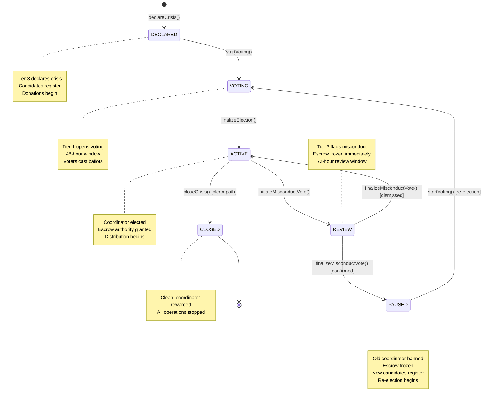
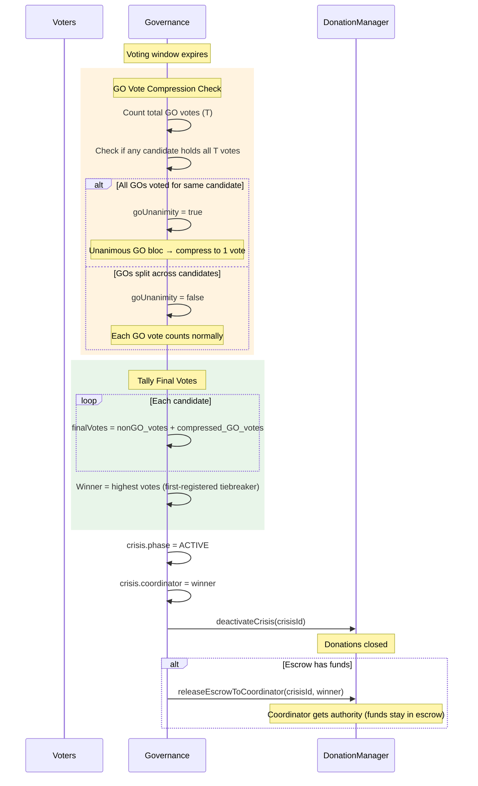
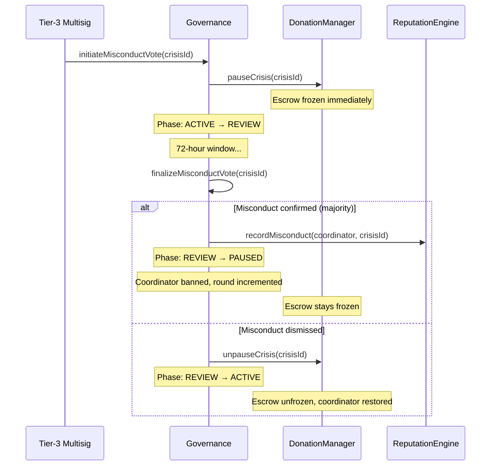

# Governance — Democratic Engine

## Purpose

The Governance contract (`contracts/Governance.sol`) implements the full crisis lifecycle: from declaration through coordinator election to closure or misconduct accountability. It is the democratic engine of OpenAID +212, ensuring that:

- Crises are declared by a broad coalition (Tier-3 multisig)
- Coordinators are elected by stakeholders with skin in the game (donation-cap voting)
- Government capture is mitigated (GO Vote Compression)
- Misconduct is detected and punished (misconduct vote → reputation slashing)
- Misbehaving coordinators are replaced through a **re-election cycle** (PAUSED → VOTING → ACTIVE)

## Contract Inheritance

```
Governance is IGovernance
```

No OpenZeppelin mixins — authority checks read directly from the Registry rather than duplicating role storage. This ensures that if the Tier-1 or Tier-3 authority address is updated in the Registry, Governance immediately respects the change.

## Constants

| Constant | Value | Purpose |
|----------|-------|---------|
| `VOTING_DURATION` | `48 hours` | Coordinator election voting window |
| `MISCONDUCT_VOTE_DURATION` | `72 hours` | Misconduct review voting window |
| `GO_CAP_MULTIPLIER` | `15` | GO must donate 15x baseDonationCap to run or vote |
| `NGO_CAP_MULTIPLIER` | `10` | NGO must donate 10x baseDonationCap to run or vote |

Donors and PrivateCompanies use a 1x multiplier. Beneficiaries are exempt from donation requirements (they vote via crisis verification).

## Crisis Lifecycle

Every crisis follows a phase progression with three possible paths:



### Phase Transitions Summary

| From | To | Triggered By | Function |
|------|----|-------------|----------|
| — | DECLARED | Tier-3 Multisig | `declareCrisis()` |
| DECLARED | VOTING | Tier-1 Operational Auth | `startVoting()` |
| PAUSED | VOTING | Tier-1 Operational Auth | `startVoting()` (re-election) |
| VOTING | ACTIVE | Anyone (after window closes) | `finalizeElection()` |
| ACTIVE | CLOSED | Tier-1 Operational Auth | `closeCrisis()` (clean path) |
| ACTIVE | REVIEW | Tier-3 Multisig | `initiateMisconductVote()` |
| REVIEW | PAUSED | Anyone (after window closes) | `finalizeMisconductVote()` (confirmed) |
| REVIEW | ACTIVE | Anyone (after window closes) | `finalizeMisconductVote()` (dismissed) |

## Crisis Declaration

### `declareCrisis(string description, uint256 severity, uint256 baseDonationCap) → uint256 crisisId`

- **Caller**: Tier-3 Crisis Declaration Multisig only
- **Severity**: 1–5 inclusive
- **baseDonationCap**: The reference amount for donation-cap voting eligibility (e.g., if baseDonationCap = 100, NGOs need 1,000 AID donated to vote)
- **Side effects**:
  - Assigns auto-incremented `crisisId` (starting at 1)
  - Calls `donationManager.activateCrisis(crisisId)` — donations open immediately
  - Phase set to `DECLARED`
- **Events**: `CrisisDeclared(crisisId, description, severity)`

### Crisis Struct

```solidity
struct Crisis {
    uint256 crisisId;
    string  description;
    uint256 severity;          // 1-5
    uint256 baseDonationCap;   // Reference for voting eligibility
    Phase   phase;             // DECLARED, VOTING, ACTIVE, REVIEW, PAUSED, CLOSED
    uint256 declaredAt;        // Block timestamp
    address coordinator;       // Elected coordinator (set after election)
    bool    misconductFlagged; // True if misconduct vote was initiated
}
```

## Coordinator Election

### Candidacy Registration: `registerAsCandidate(uint256 crisisId)`

- **Caller**: Verified GO or NGO (checked via `registry.isVerifiedValidator()`)
- **Phase**: DECLARED, VOTING, or PAUSED (late registration allowed; PAUSED enables re-election candidates)
- **Blacklist check**: Candidates blacklisted from this crisis (previous misconduct) are rejected
- **Donation cap enforcement**: Candidate must have donated at least `baseDonationCap × multiplier` to the crisis
  - GO: 15x (`GO_CAP_MULTIPLIER`)
  - NGO: 10x (`NGO_CAP_MULTIPLIER`)
- **Storage**: Candidates stored in `_candidatesList[crisisId]` with 1-indexed position in `_candidateIndexPlusOne`

### Voting: `castVote(uint256 crisisId, address candidate)`

- **Phase**: VOTING only, within the time window
- **Eligibility by role**:

| Role | Requirement |
|------|-------------|
| **Beneficiary** | Must be crisis-verified (`registry.isCrisisVerifiedBeneficiary()`) |
| **Donor** | Must have donated ≥ 1x `baseDonationCap` |
| **PrivateCompany** | Must have donated ≥ 1x `baseDonationCap` |
| **NGO** | Must have donated ≥ 10x `baseDonationCap` |
| **GO** | Must have donated ≥ 15x `baseDonationCap` |

- **GO vote tracking**: GO votes are stored separately in `goVoteCount` per candidate and `_totalGOVotes[crisisId]` globally, enabling the compression algorithm
- **Reputation integration**: If ReputationEngine is set, calls `reputationEngine.recordVoteCast(msg.sender)` for GO and NGO voters (feeds into V_i voting activeness component)
- **Double-vote prevention**: `hasVoted[voter][crisisId][round]` — uses election round to allow re-voting in new rounds after PAUSED → VOTING transitions

### Election Finalization: `finalizeElection(uint256 crisisId)`



- **Caller**: Anyone (permissionless, after voting window closes)
- **Phase**: VOTING only, `block.timestamp > votingEnd[crisisId]`
- **Tiebreaking**: Candidate who registered first wins (lower array index)
- **Effects**: Phase → ACTIVE, coordinator set, donations deactivated, escrow authority granted

## GO Vote Compression Algorithm

The compression algorithm is the key anti-capture mechanism. It prevents a government bloc from unilaterally selecting their preferred coordinator, even when they have more votes than any other single group.

**Rule:**
- Let `T` = total GO votes cast across all candidates (`_totalGOVotes[crisisId]`)
- If `T > 0` AND one candidate holds ALL `T` votes (unanimous) → that candidate gets **1 effective GO vote** (not T)
- If GOs are split across multiple candidates → each GO vote counts **at face value**

**Example:** 3 GOs all vote for Candidate A, 2 NGOs + 5 donors vote for Candidate B.
- Without compression: A gets 3, B gets 7 → B wins
- With compression: A gets 1 (compressed), B gets 7 → B wins by even more
- But if GOs split (2 for A, 1 for B): A gets 2, B gets 7+1=8 → no compression needed

## Misconduct Flow

### Initiation: `initiateMisconductVote(uint256 crisisId)`

- **Caller**: Tier-3 Multisig only
- **Phase**: ACTIVE only, coordinator must be elected, no existing misconduct flag
- **Effects**:
  - Phase → REVIEW
  - Opens 72-hour voting window, creates `MisconductTally`
  - **Freezes escrow immediately**: calls `donationManager.pauseCrisis(crisisId)`

### Voting: `castMisconductVote(uint256 crisisId, bool isMisconduct)`

- **Phase**: REVIEW only, within time window
- **Eligibility**: Must have been "involved" in the crisis (`_wasInvolvedInCrisis()`):
  - GO/NGO: Always involved (verified validators are institutional actors)
  - Beneficiary: Must be crisis-verified
  - Donor/PrivateCompany: Must have donated ≥ 1 AID to the crisis
- **Vote**: `true` = misconduct confirmed, `false` = misconduct rejected
- **Double-vote prevention**: `hasMisconductVoted[voter][crisisId]`

### Finalization: `finalizeMisconductVote(uint256 crisisId)`

- **Caller**: Anyone (permissionless, after review window closes)
- **Decision rule**: Simple majority — `votesFor > totalVotes / 2`
- **No votes cast**: Misconduct is NOT confirmed (benefit of the doubt)

#### If Misconduct Confirmed:

1. Slash reputation: `reputationEngine.recordMisconduct(coordinator, crisisId)`
2. Ban old coordinator: `_blacklisted[crisisId][coordinator] = true`
3. Strip authority: `crisis.coordinator = address(0)`
4. Phase → **PAUSED** (not CLOSED)
5. Clear misconduct flag: `crisis.misconductFlagged = false` (allows future flags for new coordinator)
6. Clear candidates list
7. Increment election round: `electionRound[crisisId] += 1`
8. Reset voting window
9. Escrow remains frozen from initiation

#### If Misconduct Dismissed:

1. Phase → **ACTIVE** (coordinator vindicated)
2. Clear misconduct flag
3. Unfreeze escrow: `donationManager.unpauseCrisis(crisisId)`



## Re-Election Cycle

When a crisis enters PAUSED:

1. **Old coordinator is banned** from this crisis (`_blacklisted[crisisId][coordinator]`)
2. **Candidates list is cleared** — all previous candidates must re-register
3. **Election round is incremented** — voters can vote again in the new round
4. **New candidates register** during PAUSED phase
5. **Tier-1 starts voting** — transitions PAUSED → VOTING
   - `donationManager.unpauseCrisis()` is called, reopening donations
6. **Election proceeds normally** — same compression algorithm, same finalization logic
7. **New coordinator distributes remaining escrow** to beneficiaries

A crisis can go through multiple re-election cycles if successive coordinators misbehave. Each cycle increments `electionRound[crisisId]`.

## Clean Closure: `closeCrisis(uint256 crisisId)`

- **Caller**: Tier-1 Operational Authority
- **Phase**: ACTIVE only, misconduct must NOT be flagged
- **Effects**: Phase → CLOSED
- **Reward**: Calls `reputationEngine.recordSuccessfulCoordination(coordinator, crisisId)` — awards linear reward dampened by timeout history and k2 phase weighting

## State Variables

| Variable | Type | Purpose |
|----------|------|---------|
| `registry` | `IRegistry` (immutable) | Identity and authority lookups |
| `donationManager` | `IDonationManager` (immutable) | Escrow management, donation caps |
| `reputationEngine` | `IReputationEngine` | Reputation scoring (set post-deployment, can be address(0)) |
| `nextCrisisId` | `uint256` | Auto-incrementing crisis ID (starts at 1) |
| `_crises` | `mapping(uint256 => Crisis)` | Crisis records |
| `_candidatesList` | `mapping(uint256 => Candidacy[])` | Candidates per crisis |
| `_candidateIndexPlusOne` | `mapping(uint256 => mapping(address => uint256))` | 1-indexed candidate lookup (0 = not registered) |
| `_totalGOVotes` | `mapping(uint256 => uint256)` | Total GO votes per crisis |
| `votingStart` / `votingEnd` | `mapping(uint256 => uint256)` | Election time window |
| `hasVoted` | `mapping(address => mapping(uint256 => mapping(uint256 => bool)))` | Double-vote prevention per round: `hasVoted[voter][crisisId][round]` |
| `hasMisconductVoted` | `mapping(address => mapping(uint256 => bool))` | Double-vote prevention (misconduct) |
| `_misconductTally` | `mapping(uint256 => MisconductTally)` | Misconduct vote counts |
| `_blacklisted` | `mapping(uint256 => mapping(address => bool))` | Banned coordinators per crisis |
| `electionRound` | `mapping(uint256 => uint256)` | Election round counter per crisis (starts at 0) |

## View Functions

| Function | Returns |
|----------|---------|
| `getCrisis(crisisId)` | Full `Crisis` struct |
| `getCandidates(crisisId)` | Array of `Candidacy` structs |
| `getMisconductTally(crisisId)` | `MisconductTally` struct (votesFor, votesAgainst, time window) |

## Custom Errors

| Error | Trigger |
|-------|---------|
| `CrisisNotFound(crisisId)` | Crisis ID does not exist |
| `InvalidSeverity(severity)` | Severity not in 1–5 range |
| `NotCrisisDeclarationAuthority(caller)` | Non-Tier-3 caller for Tier-3 function |
| `NotOperationalAuthority(caller)` | Non-Tier-1 caller for Tier-1 function |
| `WrongPhase(crisisId, actual)` | Operation called in wrong phase |
| `AlreadyCandidate(addr, crisisId)` | Double candidacy registration |
| `NotACandidate(candidate, crisisId)` | Vote for non-candidate |
| `NotVerifiedValidator(addr)` | Non-verified GO/NGO trying to register as candidate |
| `InsufficientDonation(addr, required, actual)` | Donation below role-specific cap |
| `NotCrisisVerifiedBeneficiary(addr, crisisId)` | Unverified beneficiary trying to vote |
| `NoCandidates(crisisId)` | Starting voting with no candidates |
| `VotingStillOpen(crisisId)` | Finalizing election before window closes |
| `VotingClosed(crisisId)` | Voting after window closes |
| `AlreadyVoted(voter, crisisId)` | Double vote in election (same round) |
| `AlreadyMisconductVoted(voter, crisisId)` | Double vote in misconduct review |
| `NotRegistered(addr)` | Unregistered address trying to vote |
| `MisconductVotingStillOpen(crisisId)` | Finalizing misconduct before window closes |
| `MisconductVotingClosed(crisisId)` | Misconduct vote after window closes |
| `MisconductAlreadyFlagged(crisisId)` | Second misconduct initiation for same crisis |
| `CoordinatorNotElected(crisisId)` | Misconduct vote before election |
| `NotInvolvedInCrisis(addr, crisisId)` | Non-participant trying to vote on misconduct |
| `BlacklistedFromCrisis(addr, crisisId)` | Banned coordinator trying to re-register |
