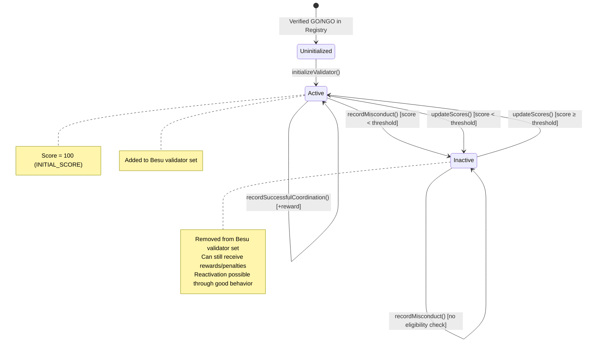

# ReputationEngine — Dynamic Validator Scoring

## Purpose

The ReputationEngine (`contracts/ReputationEngine.sol`) is the bridge between the thesis's evolutionary game theory (EGT) analysis and the on-chain system. It translates abstract game-theoretic incentives into concrete numerical scores that determine which validators participate in Besu's QBFT consensus.

The contract:

- Maintains a **reputation score** for each validator (GO or NGO)
- Applies **quadratic penalties** for misconduct (increasing deterrent)
- Awards **linear rewards** for honest coordination (dampened by past behavior)
- Weights all behavioral scoring by the **current system phase** (k2)
- Manages the **Besu validator set** — adding/removing validators based on eligibility thresholds
- Enforces a **minimum validator safety floor** (MIN_VALIDATORS = 4 for QBFT)

## The Scoring Formula

The core formula from the thesis EGT analysis:

```
R_i(n) = R_i(n-1) + k1 × B_i + k2 × C_i
```

Where:
- `R_i(n)` = validator i's score at epoch n
- `R_i(n-1)` = previous epoch score
- `k1` = participation weight (phase-dependent, e.g., 0.70 during preparedness)
- `B_i` = participation quality score (0–100)
- `k2` = behavioral weight (phase-dependent, e.g., 0.30 during preparedness)
- `C_i` = behavioral quality score (rewards minus penalties)

The k1 component (participation) is applied during the epoch-based `updateScores()` call. The k2 component (behavioral) is applied immediately when `recordMisconduct()` or `recordSuccessfulCoordination()` is called.

## B_i — Participation Quality

```
B_i = w_role × [α × A_i + (1 - α) × V_i]
```

### Components

**A_i — Attendance Ratio:**
```
A_i = roundsParticipated / totalRoundsEligible
```

Computed from the `roundsParticipated` and `totalRoundsEligible` counters in each validator's score record. Tracked by `recordParticipation()` (Tier-1 gated). Returns 0–100 (scaled by SCALE).

**V_i — Voting Activeness (Saturation Curve):**
```
V_i ≈ β × votes / (SCALE + β × votes)
```

This is an integer approximation of `1 - e^(-β × votes)`, implemented in `_votingSaturation()`.

The saturation curve prevents spam-voting from gaming the system. Early votes count heavily, but additional votes have diminishing returns:

| Votes Cast | V_i (out of 100) |
|-----------|-----------------|
| 0 | 0 |
| 1 | 33 |
| 2 | 50 |
| 5 | 71 |
| 10 | 83 |
| 100 | 98 |

A validator who votes once gets 33% credit. One who votes 100 times only gets 3x that. This makes it uneconomical to spam votes for marginal reputation gain.

**w_role — Role Weight:**

| Role | Weight | Constant | Rationale |
|------|--------|----------|-----------|
| NGO | 1.00 | `W_ROLE_NGO = 100` | Full weight — primary humanitarian actors |
| GO | 0.85 | `W_ROLE_GO = 85` | Compressed to counteract government capture risk |

**α — Balance Factor:**
- `ALPHA = 60` — attendance counts for 60%, voting for 40%
- This prioritizes showing up (consensus participation) over voting (governance participation)

### Participation Calculation (`_calculateParticipation()`)

```solidity
// Combined to avoid divide-before-multiply precision loss
return (ALPHA * ai + (SCALE - ALPHA) * vi) * wRole / (SCALE * SCALE);
```

Returns 0–100. Applied in `updateScores()` as: `score += k1 × B_i / SCALE`.

## C_i — Behavioral Quality

C_i represents the net effect of rewards and penalties. Unlike B_i (computed at epoch boundaries), C_i is applied **immediately** when events occur.

### Penalty: `recordMisconduct()`

```
P_penalty = P0 × w_role × (1 + α_crisis × n²) × (k2 / SCALE)
```

In Solidity:
```solidity
uint256 penalty = P0 * wRole * (SCALE + config.alphaCrisis * n * n) / (SCALE * SCALE);
penalty = penalty * config.k2 / SCALE;
```

Where:
- `P0 = 2` — base penalty constant
- `w_role` — role weight (100 for NGO, 85 for GO)
- `α_crisis` — phase-dependent penalty multiplier (100 in preparedness, 250 in active crisis)
- `n` — cumulative misconduct count (after increment)
- `k2` — phase-dependent behavioral weight (30 in preparedness, 60 in active crisis)

#### Quadratic Penalty Growth

The `n²` term is the key deterrent. With PREPAREDNESS phase (α_crisis=100, k2=30):

| Offense # | n | Base Penalty | After k2 Weighting | Cumulative | Score (from 100) |
|-----------|---|-------------|-------------------|-----------|-------------------|
| 1st | 1 | 4 | 1 | 1 | 99 |
| 2nd | 2 | 10 | 3 | 4 | 96 |
| 3rd | 3 | 20 | 6 | 10 | 90 |
| 4th | 4 | 34 | 10 | 20 | 80 |
| 5th | 5 | 52 | 15 | 35 | 65 |

With ACTIVE_CRISIS phase (α_crisis=250, k2=60):

| Offense # | n | Base Penalty | After k2 Weighting | Cumulative | Score (from 100) |
|-----------|---|-------------|-------------------|-----------|-------------------|
| 1st | 1 | 7 | 4 | 4 | 96 |
| 2nd | 2 | 22 | 13 | 17 | 83 |
| 3rd | 3 | 47 | 28 | 45 | 55 |
| 4th | 4 | 82 | 49 | 94 | 6 |
| 5th | 5 | 127 | 76 | 170 | 0 (floored) |

During an active crisis, 3 offenses is nearly fatal. 4 offenses effectively means permanent exclusion. This asymmetry is intentional: the system must be extremely intolerant of misconduct during active crisis response.

#### Immediate Eligibility Check

After applying the penalty, `recordMisconduct()` immediately checks whether the validator should be deactivated:

1. Compute current average score across all validators
2. Compute threshold: NGO = average, GO = average × 1.2 (`GAMMA_GO`)
3. If `score < threshold` AND `activeCount > MIN_VALIDATORS` → deactivate
4. Call `besuPermissioning.removeValidator()` if Besu permissioning is set

This means a severe misconduct penalty can remove a validator from the consensus set in the same transaction.

### Reward: `recordSuccessfulCoordination()`

```
R_reward = R0 × w_role × ceiling_reducer × (k2 / SCALE)
```

In Solidity:
```solidity
uint256 reward = R0 * wRole * ceilingReducer / (SCALE * SCALE);
PhaseConfig memory config = _phaseConfigs[currentPhase];
reward = reward * config.k2 / SCALE;
```

Where:
- `R0 = 10` — base reward constant
- `ceiling_reducer` — timeout-based dampening factor (0–100)

#### Ceiling Reducer

```
ceiling_reducer = 1 / (1 + β × ln(1 + n_timeout))
```

Implemented in `_calculateCeilingReducer()`. A history of timeouts (non-participation) permanently reduces future reward capacity:

| Timeouts | ceiling_reducer (out of 100) | Effective Reward (NGO, k2=30) |
|----------|----------------------------|------------------------------|
| 0 | 100 | 3 |
| 1 | 74 | 2 |
| 2 | 64 | 1 |
| 5 | 55 | 1 |
| 10 | 46 | 1 |

The logarithmic decay means the reduction is steepest for the first few timeouts and flattens for chronic offenders. Past irresponsibility permanently limits (but never eliminates) future earning capacity.

#### Natural Logarithm Approximation (`_lnScaled()`)

Returns `ln(x) × 100` using:
- **Lookup table** for x = 1..11 (exact values, e.g., ln(2)×100 = 69, ln(10)×100 = 230)
- **Padé approximation** for x > 11: `ln(x) ≈ ln(10) + 2×(x-10)/(x+10)`
- Accuracy: within ~3% for x ≤ 30, sufficient for the expected range of timeout counts

## Phase-Dependent Parameters

The system operates in three phases, each with different scoring weights:

| Phase | k1 (Participation) | k2 (Behavioral) | α_crisis (Penalty Multiplier) | Rationale |
|-------|:---:|:---:|:---:|-----------|
| **PREPAREDNESS** | 70 (0.70) | 30 (0.30) | 100 (1.0) | Calm period — participation matters most, penalties are mild |
| **ACTIVE_CRISIS** | 40 (0.40) | 60 (0.60) | 250 (2.5) | Emergency — behavioral integrity is critical, penalties are severe |
| **RECOVERY** | 65 (0.65) | 35 (0.35) | 150 (1.5) | Transitional — re-establishing norms, moderate penalties |

### Why Phase Weights Differ

- **Preparedness** (k1=70, k2=30): The system is calm. Showing up and voting matters more than crisis response behavior. Penalties are light because there's no active crisis to mismanage.
- **Active Crisis** (k1=40, k2=60): During a crisis, behavioral integrity dominates. A coordinator who misappropriates funds during an earthquake response must face severe consequences. The 2.5x penalty multiplier combined with 60% k2 weight means a single misconduct event is devastating.
- **Recovery** (k1=65, k2=35): The system is stabilizing. Participation matters again (rebuilding institutional norms), but penalties remain elevated to prevent post-crisis opportunism.

Phase transitions are triggered by the Tier-1 Operational Authority via `setSystemPhase()`. Phase configs can be updated by the Tier-3 Multisig via `setPhaseConfig()`, subject to the invariant `k1 + k2 = SCALE (100)`.

## Eligibility Thresholds

After each epoch update, validators are checked against dynamic thresholds:

| Role | Threshold | Constant |
|------|-----------|----------|
| **NGO** | `averageScore` | — |
| **GO** | `averageScore × GAMMA_GO / SCALE` = `averageScore × 1.2` | `GAMMA_GO = 120` |

GOs face a 20% higher bar than NGOs. This reflects the higher standard expected of government actors and counteracts the inherent advantage of institutional resources.

### MIN_VALIDATORS Safety Floor

```solidity
uint256 public constant MIN_VALIDATORS = 4;
```

QBFT consensus requires a minimum validator set to maintain liveness. The system will **never** deactivate a validator if doing so would drop the active count below 4. This applies both in `updateScores()` (epoch eligibility) and `recordMisconduct()` (immediate deactivation).

## Epoch Update: `updateScores()`

Called periodically by an off-chain cron script (`scripts/epoch-cron.ts`) or by anyone (permissionless).

### Algorithm

```
1. Epoch guard: revert if _lastUpdatedEpoch == currentEpoch
2. Set _lastUpdatedEpoch = currentEpoch (reentrancy prevention)
3. For each validator:
   a. Compute B_i = _calculateParticipation(validator)
   b. score.currentScore += k1 × B_i / SCALE
4. Compute averageScore across all validators
5. For each validator:
   a. Compute threshold (role-adjusted)
   b. If score ≥ threshold AND inactive → activate (add to Besu)
   c. If score < threshold AND active AND activeCount > MIN_VALIDATORS → deactivate (remove from Besu)
6. Emit ScoresUpdated(epoch)
7. Advance epoch: currentEpoch += 1
```

Gas complexity: O(n) where n = registered validators. Acceptable for the expected 10–20 validators in the Moroccan humanitarian context.

## Validator Lifecycle



## State Variables

| Variable | Type | Purpose |
|----------|------|---------|
| `registry` | `IRegistry` (immutable) | Identity and role lookups |
| `governanceContract` | `address` | Authorized caller for recordMisconduct/recordSuccess |
| `besuPermissioning` | `IBesuPermissioning` (immutable) | Besu validator set management (can be address(0)) |
| `currentPhase` | `SystemPhase` | Current operational phase (PREPAREDNESS/ACTIVE_CRISIS/RECOVERY) |
| `currentEpoch` | `uint256` | Auto-incrementing epoch counter (starts at 1) |
| `_scores` | `mapping(address => ValidatorScore)` | Reputation records |
| `_validators` | `address[]` | Ordered list of all registered validators |
| `_phaseConfigs` | `mapping(SystemPhase => PhaseConfig)` | Phase-dependent scoring parameters |
| `_lastUpdatedEpoch` | `uint256` | Epoch guard — prevents double updates |

## Constants Summary

| Constant | Value | Meaning |
|----------|-------|---------|
| `SCALE` | 100 | Integer arithmetic scale factor |
| `INITIAL_SCORE` | 100 | Starting score for all validators |
| `R0` | 10 | Base reward per successful coordination |
| `P0` | 2 | Base penalty per misconduct event |
| `ALPHA` | 60 | Attendance weight in B_i (60% attendance, 40% voting) |
| `BETA` | 50 | Voting saturation rate / timeout decay rate |
| `W_ROLE_NGO` | 100 | NGO role weight (1.0) |
| `W_ROLE_GO` | 85 | GO role weight (0.85) |
| `GAMMA_GO` | 120 | GO eligibility multiplier (1.2x average) |
| `MIN_VALIDATORS` | 4 | QBFT minimum active validator safety floor |

## View Functions

| Function | Returns |
|----------|---------|
| `getValidatorScore(validator)` | Full `ValidatorScore` struct |
| `getActiveValidators()` | Array of currently active validator addresses |
| `getAverageScore()` | Mean score across all validators |
| `getPhaseConfig(phase)` | `PhaseConfig` struct (k1, k2, alphaCrisis) |
| `getValidatorCount()` | Total registered validators (active + inactive) |
| `getAllValidators()` | Array of all registered validator addresses |

## Custom Errors

| Error | Trigger |
|-------|---------|
| `ZeroAddress()` | Zero address in constructor |
| `NotGovernance(caller)` | Non-Governance caller for restricted functions |
| `NotOperationalAuthority(caller)` | Non-Tier-1 for phase transitions or participation recording |
| `NotCrisisDeclarationAuthority(caller)` | Non-Tier-3 for setGovernanceContract or setPhaseConfig |
| `ValidatorAlreadyInitialized(validator)` | Double initialization |
| `ValidatorNotInitialized(validator)` | Operation on uninitialized validator |
| `NotVerifiedValidator(validator)` | Initializing an unverified address |
| `InvalidPhaseConfig(k1, k2)` | k1 + k2 != SCALE |
| `EpochAlreadyUpdated(epoch)` | Double updateScores() in same epoch |
