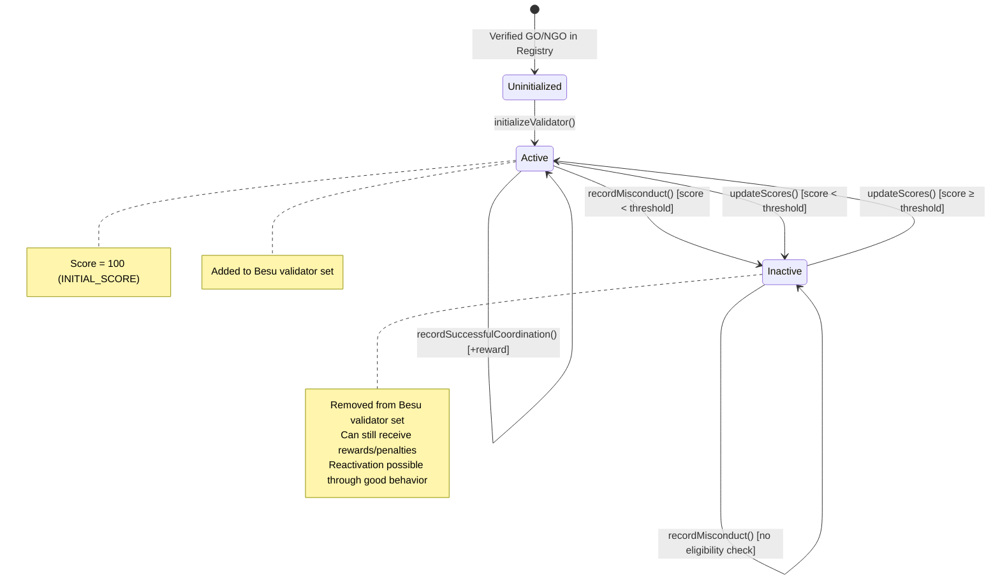

# ReputationEngine — Dynamic Validator Scoring

## Overview 
The ReputationEngine maintains a numerical score for each validator (GO or NGO) that determines whether they remain in the Besu QBFT validator set or not. The score is updated through two independent paths. 

The first path is periodic: at each epoch boundary, the` updateScores()` function recalculates the participation quality component (B_i), which combines two measurable behaviors by the validator 
- block production activity  A_i , this gives us an ides on how consistently the validator's node produces and signs blocks in QBFT consensus rounds
- governance voting activity  V_i, this gives us an idea on how frequently the validator casts votes in coordinator elections and misconduct reviews
when it comes to weights, block production activity carries 60% weight and governance voting activity carries 40%, this stemze from the fact that keeping the network operational is the validator's primary obligation

The second path is event-driven: when a coordinator is found guilty of misconduct, `recordMisconduct()` immediately applies a quadratic penalty to their score, and when a coordinator successfully completes a crisis, `recordSuccessfulCoordination()` applies a linear reward. Both penalties and rewards are dependant on the current system phase:
=> during an active crisis, behavioral events carry twice the weight they do during calm periods, and penalties are 2.5x harsher. 

If a validator's score falls below a dynamic threshold (the average score for NGOs, 20% above average for GOs), they are removed from the Besu validator set. If it recovers above the threshold in a subsequent epoch, they are reinstated.

what the contract does :
- Maintains a **reputation score** for each validator (GO or NGO)
- Applies **quadratic penalties** for misconduct (increasing deterrent)
- Awards **linear rewards** for honest coordination (dampened by past behavior)
- Weights all scoring by the **current system phase** (k1 for participation, k2 for behavioral)
- Manages the **Besu validator set** — adding/removing validators based on eligibility thresholds
- Enforces a **minimum validator safety floor** (MIN_VALIDATORS = 4 for QBFT)

## The Scoring Formula
The scoring formula calculates each validator's reputation as the sum of their previous score plus two weighted components (basically what u had before plus the reward) :
- how active they are in the system` k1 × B_i `
- how they behave when entrusted with responsibility. `k2 × C_i`

```
R_i(n) = R_i(n-1) + k1 × B_i + k2 × C_i
```
Lets break down  `k1 × B_i + k2 × C_i` starting by `k1 × B_i`:
1. `k1 × B_i`:
      -  During calm periods (preparedness phase), k1 is 70 out of 100, meaning participation accounts for 70% of the score update. During an active crisis, k1 drops to 40 
     - participation quality component (B_i) measures the validator's ongoing engagement with the system through two activities :  block production activity (A_i) and governance voting activity (V_i) =>
```
B_i = w_role × [α × A_i + (1 - α) × V_i]

```
   - A_i idea is to measure attendance "are you helping keep the system alive" its calculated simply ``roundsParticipated / totalRoundsEligible``, both are counters,  one counts every round the validator was Eligible in and the other counts evry round that they Participated in. This data comes from off-chain monitoring of Besu block headers and is reported on-chain via `recordParticipation()` by the Tier-1 Operational Authority (more on this below). 
   - V_i measures governance decisions sctivity,  coordinator elections (`castVote()`) and misconduct reviews (`castMisconductVote()`). Each time a GO or NGO validator casts a vote, the Governance contract calls recordVoteCast() on the ReputationEngine, incrementing their votesCast counter. V_i uses a saturation curve rather than a simple ratio: the first few votes count the most for the score while additional votes have less and less returns. ( for example : One vote gives 33% credit, five votes give 71%, and a hundred votes only reach 98%.),  this rewards early engagement more than accumulated history
   - A_i carries 60% weight in the participation quality while V_i carries the rest, α is 60% and the rest is 1-α 40%.


2. `k2 × C_i`:
   - K2 is the inverse of k1, 30 during preparedness, 60 during active crisis. This means that during a crisis, a single misconduct event hits nearly twice as hard as it would during peacetime.
   - C_i captures the consequences of being in charge. When a coordinator successfully distributes aid and the crisis is closed cleanly, `recordSuccessfulCoordination() `adds a reward to their score. When a coordinator is found guilty of misconduct by majority vote,` recordMisconduct() `subtracts a penalty. These are applied immediately when the event occurs, not batched at epoch end. 

why B_i and C_i are applied at different times is practical: block production activity and voting activity accumulate gradually over many rounds so it makes sense to batch periodically. While Misconduct and successful coordination are discrete events with immediate consequences
=>  waiting until the next epoch to slash a misbehaving coordinator would leave a window where they could continue operating with a score that doesn't reflect their actions.


### Components

**A_i — Attendance Ratio:**
```
A_i = roundsParticipated / totalRoundsEligible
```
A simple ratio of how many consensus rounds the validator participated in versus how many they were eligible for. Both values are counters stored in the validator's score record, incremented by `recordParticipation()`.

**How `recordParticipation()` Works**:
```solidity 
score.totalRoundsEligible += 1;
if (participated) {
    score.roundsParticipated += 1;
} else {
    score.timeoutCount += 1;
}
```
The contract itself is simple,  it receives a boolean and increments counters:
The actual detection of whether a validator participated in a consensus round happens off-chain. In QBFT, every block header contains the signatures of validators who signed that block. A monitoring script would read these block headers via Besu's RPC API, check which validators signed, and call `recordParticipation(validator, true/false)` accordingly. Only the Tier-1 Operational Authority can call this function.

**Current prototype status:** The function is implemented, deployed, and tested, but no monitoring script feeds it real data from Besu. In tests, participation is simulated by calling the function manually. In production, an off-chain service would automate this by reading QBFT block headers and reporting participation on-chain. The contract requires no changes for this , only the off-chain integration needs to be built.

The `timeoutCount` (missed rounds) also feeds into the ceiling reducer for rewards, so missing rounds doesn't just lower the participation score, it permanently dampens how much the validator can earn from successful coordination.


**V_i — Voting Activeness (Saturation Curve):**
```
V_i ≈ β × votes / (SCALE + β × votes)
```

An integer approximation of `1 - e^(-β × votes)`, implemented in `_votingSaturation()`. Each time a GO or NGO casts a vote in a coordinator election or misconduct review, the Governance contract calls `recordVoteCast()` on the ReputationEngine, incrementing their votesCast counter.
V_i would look like this when played out

| Votes Cast | V_i (out of 100) |
|-----------|-----------------|
| 0 | 0 |
| 1 | 33 |
| 2 | 50 |
| 5 | 71 |
| 10 | 83 |
| 100 | 98 |


**w_role — Role Weight:**

| Role | Weight | Constant | Rationale |
|------|--------|----------|-----------|
| NGO | 1.00 | `W_ROLE_NGO = 100` | Full weight — primary humanitarian actors |
| GO | 0.85 | `W_ROLE_GO = 85` | Compressed to counteract government capture risk |


### B_i Calculation (`_calculateParticipation()`)

```solidity
// Combined to avoid divide-before-multiply precision loss
return (ALPHA * ai + (SCALE - ALPHA) * vi) * wRole / (SCALE * SCALE);
```

Returns 0–100. Applied in `updateScores()` as: `score += k1 × B_i / SCALE`.

## C_i — Behavioral Quality
C_i does not have a single formula that is computed at once. It is the cumulative effect of individual reward and penalty events applied directly to the score as they occur. Each call to `recordMisconduct()` subtracts a penalty from the score. Each call to `recordSuccessfulCoordination()` adds a reward. The k2 phase weight is applied to each individual event at the time it happens.

In the context of the full formula `R_i(n) = R_i(n-1) + k1 × B_i + k2 × C_i`, the `k2 × C_i` portion is not computed as a batch but it is the sum of all penalty and reward transactions that occurred since the last epoch, each already weighted by k2 when they were applied.


### Penalty: `recordMisconduct()`
Called by the Governance contract when a misconduct vote confirms wrongdoing. The penalty formula:

```
penalty = P0 × w_role × (SCALE + α_crisis × n²) / (SCALE × SCALE)
penalty = penalty × k2 / SCALE
score -= penalty (floored at 0)
```

Where:
- `P0 = 2` — base penalty constant
- `w_role` — role weight (100 for NGO, 85 for GO)
- `α_crisis` — phase-dependent penalty multiplier (100 in preparedness, 250 in active crisis)
- `n` — cumulative misconduct count (after increment)
- `k2` — phase-dependent behavioral weight (30 in preparedness, 60 in active crisis)

The n² term is the core deterrent. The penalty doesn't just increase with each offense , it accelerates. With preparedness phase settings:

| Offense # | n | Base Penalty | After k2 Weighting | Cumulative | Score (from 100) |
|-----------|---|-------------|-------------------|-----------|-------------------|
| 1st | 1 | 4 | 1 | 1 | 99 |
| 2nd | 2 | 10 | 3 | 4 | 96 |
| 3rd | 3 | 20 | 6 | 10 | 90 |
| 4th | 4 | 34 | 10 | 20 | 80 |
| 5th | 5 | 52 | 15 | 35 | 65 |

With active crisis phase settings (penalties 2.5x harsher, k2 doubled):

| Offense # | n | Base Penalty | After k2 Weighting | Cumulative | Score (from 100) |
|-----------|---|-------------|-------------------|-----------|-------------------|
| 1st | 1 | 7 | 4 | 4 | 96 |
| 2nd | 2 | 22 | 13 | 17 | 83 |
| 3rd | 3 | 47 | 28 | 45 | 55 |
| 4th | 4 | 82 | 49 | 94 | 6 |
| 5th | 5 | 127 | 76 | 170 | 0 (floored) |

During an active crisis, 3 offenses is nearly fatal. 4 offenses effectively means permanent exclusion. This asymmetry is intentional: the system must be extremely intolerant of misconduct during active crisis response.

After applying the penalty, `recordMisconduct()` immediately checks whether the validator should be deactivated:

1. Compute the current average score across all validators
2. Compute the threshold: average for NGOs, average × 1.2 for GOs
3. If the score fell below the threshold and there are more than 4 active validators, deactivate the validator and call `besuPermissioning.removeValidator()`

This means a severe misconduct penalty can remove a validator from the consensus set in the same transaction.

### Reward: `recordSuccessfulCoordination()`
Called by the Governance contract when a crisis is closed cleanly via `closeCrisis()`. The reward formula:

```
ceiling_reducer = SCALE × SCALE / (SCALE + BETA × ln(1 + timeoutCount) / SCALE)
reward = R0 × w_role × ceiling_reducer / (SCALE × SCALE)
reward = reward × k2 / SCALE
score += reward
```

Where:
- `R0 = 10` — base reward constant
- `ceiling_reducer` — timeout-based dampening factor (0–100)

The ceiling reducer is what makes this asymmetric with the penalty. A validator with a clean participation record (zero timeouts) gets the full reward while A validator who has missed rounds in the past gets a permanently reduced reward. The reduction follows a logarithmic curve, meaning the first few timeouts have the steepest impact, then it flattens:

| Timeouts | ceiling_reducer (out of 100) | Effective Reward (NGO, k2=30) |
|----------|----------------------------|------------------------------|
| 0 | 100 | 3 |
| 1 | 74 | 2 |
| 2 | 64 | 1 |
| 5 | 55 | 1 |
| 10 | 46 | 1 |

This creates a permanent but not absolute consequence for past irresponsibility. You can still earn rewards, just less of them.
The natural logarithm needed for the ceiling reducer is approximated in _lnScaled() using a lookup table for values 1–11 (exact) and a Padé approximation for larger values (within 3% accuracy up to 30). This is enough for the expected range of timeout counts.


## Phase-Dependent Parameters

The system operates in three phases, each with different scoring weights:

| Phase | k1 (Participation) | k2 (Behavioral) | α_crisis (Penalty Multiplier) | Rationale |
|-------|:---:|:---:|:---:|-----------|
| **PREPAREDNESS** | 70 (0.70) | 30 (0.30) | 100 (1.0) | Calm period — participation matters most, penalties are mild |
| **ACTIVE_CRISIS** | 40 (0.40) | 60 (0.60) | 250 (2.5) | Emergency — behavioral integrity is critical, penalties are severe |
| **RECOVERY** | 65 (0.65) | 35 (0.35) | 150 (1.5) | Transitional — re-establishing norms, moderate penalties |

During preparedness, the system is calm, block production activity and governance voting matter most (k1=70), and penalties are mild. During an active crisis, behavioral integrity dominates (k2=60) and penalties are 2.5× harsher because mismanaging aid during an emergency is far more damaging. During recovery, the system transitions back toward normal , participation matters again but penalties remain elevated to prevent post-crisis opportunism.
k1 + k2 always equals 100, enforced by `setPhaseConfig()`. Phase transitions are triggered by the Tier-1 Operational Authority via `setSystemPhase()`. Phase parameters can be updated by the Tier-3 Multisig, since these values directly control slashing severity.

## Eligibility Thresholds

After each epoch update, validators are checked against dynamic thresholds:

| Role | Threshold | Constant |
|------|-----------|----------|
| **NGO** | `averageScore` | — |
| **GO** | `averageScore × GAMMA_GO / SCALE` = `averageScore × 1.2` | `GAMMA_GO = 120` |

GOs face a 20% higher bar than NGOs. This reflects the higher standard expected of government actors and counteracts the inherent advantage of institutional resources.

### MIN_VALIDATORS Safety Floor

```solidity
uint256 public constant MIN_VALIDATORS = 4;
```

QBFT consensus requires a minimum validator set to maintain liveness. The system will **never** deactivate a validator if doing so would drop the active count below 4. This applies both in `updateScores()` (epoch eligibility) and `recordMisconduct()` (immediate deactivation).

## Epoch Update: `updateScores()`
Called periodically by an off-chain cron script (scripts/epoch-cron.ts) or by anyone (the function is permissionless). The algorithm:

1. Check epoch guard : revert if already updated this epoch (prevents score inflation attacks)
2. Set the guard before external calls (reentrancy prevention)
3. For each validator: compute B_i via _calculateParticipation(), add k1 × B_i / SCALE to their score
4. Compute the average score across all validators
5. For each validator: check against their role-adjusted threshold. Activate or deactivate accordingly, respecting the MIN_VALIDATORS floor
6. Emit ScoresUpdated(epoch) and advance the epoch counter


Gas complexity: O(n) where n = registered validators. Acceptable for the expected 10–20 validators in the Moroccan humanitarian context.

## Validator Lifecycle



## Besu Integration

The ReputationEngine manages the Besu validator set through the `IBesuPermissioning` interface, which exposes two functions: `addValidator()` and `removeValidator()`. These are called in three places: `initializeValidator()` adds new validators when they're first registered, `recordMisconduct()` removes validators immediately if a penalty drops them below threshold, and `updateScores()` adds or removes validators during periodic eligibility checks.
All calls are guarded by if `(address(besuPermissioning) != address(0))`, so the system works without a permissioning contract during testing.

**Current prototype:** The besuPermissioning address points to a mock contract (MockBesuPermissioning) that records `addValidator/removeValidator` calls without affecting actual consensus. This allows testing that the ReputationEngine triggers the right permissioning actions at the right times.
Production deployment: The mock address would be replaced with Besu's real node permissioning smart contract. Besu natively supports this via the `--permissions-nodes-contract-enabled `and `--permissions-nodes-contract-address` configuration flags. The ReputationEngine code requires no changes since the same `IBesuPermissioning `interface works with both the mock and the real contract. 

Disclaimer : No modifications to Besu's consensus algorithm (Go or Java code) are needed.

## State Variables

| Variable | Type | Purpose |
|----------|------|---------|
| `registry` | `IRegistry` (immutable) | Identity and role lookups |
| `governanceContract` | `address` | Authorized caller for recordMisconduct/recordSuccess |
| `besuPermissioning` | `IBesuPermissioning` (immutable) | Besu validator set management (can be address(0)) |
| `currentPhase` | `SystemPhase` | Current operational phase (PREPAREDNESS/ACTIVE_CRISIS/RECOVERY) |
| `currentEpoch` | `uint256` | Auto-incrementing epoch counter (starts at 1) |
| `_scores` | `mapping(address => ValidatorScore)` | Reputation records |
| `_validators` | `address[]` | Ordered list of all registered validators |
| `_phaseConfigs` | `mapping(SystemPhase => PhaseConfig)` | Phase-dependent scoring parameters |
| `_lastUpdatedEpoch` | `uint256` | Epoch guard — prevents double updates |

## Constants Summary

| Constant | Value | Meaning |
|----------|-------|---------|
| `SCALE` | 100 | Integer arithmetic scale factor |
| `INITIAL_SCORE` | 100 | Starting score for all validators |
| `R0` | 10 | Base reward per successful coordination |
| `P0` | 2 | Base penalty per misconduct event |
| `ALPHA` | 60 | Attendance weight in B_i (60% attendance, 40% voting) |
| `BETA` | 50 | Voting saturation rate / timeout decay rate |
| `W_ROLE_NGO` | 100 | NGO role weight (1.0) |
| `W_ROLE_GO` | 85 | GO role weight (0.85) |
| `GAMMA_GO` | 120 | GO eligibility multiplier (1.2x average) |
| `MIN_VALIDATORS` | 4 | QBFT minimum active validator safety floor |


